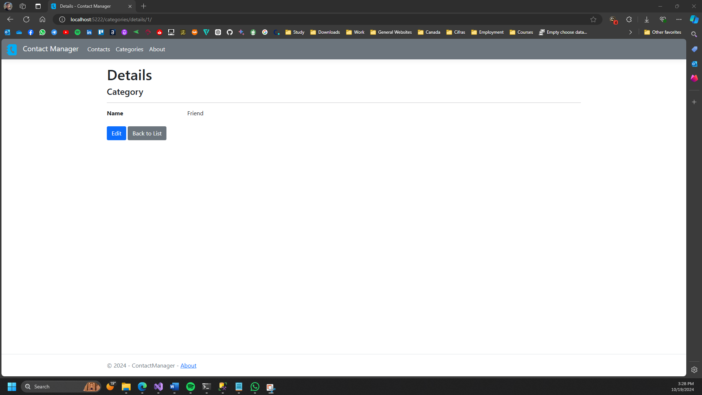

# COMP2084Assignment2_ContactManagerApp

# Contact Manager App

This is a repository of an ASP.NET application created for an assignment, intended for learning purposes.

**Assignment Detail:** COMP2084 Assignment 2
**Created on:** 2024-10-14

## Students Information

- <a href="https://github.com/marcosmota5" title="GitHub Profile">Marcos Oliveira Mota (200564426)</a>
- <a href="https://github.com/200587841" title="GitHub Profile">Natália Dias (200587841)</a>
- <a href="https://github.com/sergiocutrim" title="GitHub Profile">Sergio Cutrim Gouveia (200579843)</a>
- <a href="https://www.linkedin.com/in/aynur-vuran/" title="LinkedIn Profile">Aynur Vuran (200577768)</a>

## Description

Contact Manager App is designed to manage user's contacts with the option to add, edit, and delete. The user can also set specific categories for each contact and manage them.

### Setup Instructions
To run the application:
1. Copy the repository.
2. Execute the EF Core migration command in the Package Manager Console: Update-Database.
3. Run the application.

## Screenshots

### Home/Contacts  

### Add/Edit contact

### Contact details

### Delete contact

### Categories 

### Add/Edit category

### Category details

### Delete category

### About

## Technologies Used

- **ASP.NET**
- **C#**
- **HTML**
- **CSS** 
- **JavaScript**
- **Bootstrap**
- **Entity Framework**
- **SQL Server**

## Other

A big thanks to <a href="https://www.flaticon.com/" title="Flaticon">Flaticon</a> for providing for free so many amazing images. This app icon in this project comes from Flaticon, so all rights are reserved to it.